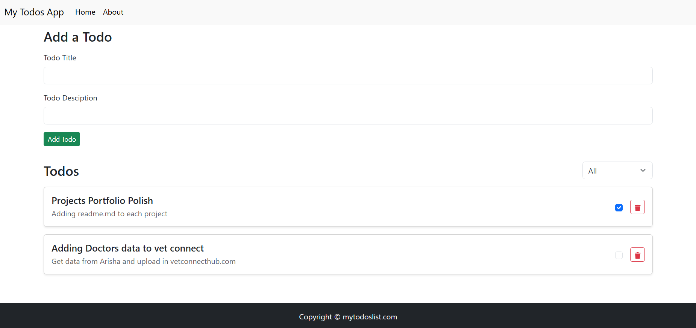

# React Todo App

## Overview
This project is a simple **Todo application** built when I started learning React.  
It demonstrates core concepts like **state management, component structure, and CRUD operations**.  
The app was developed and tested locally to practice React fundamentals.

## Features
- Add new tasks
- Mark tasks as complete/incomplete
- Delete tasks
- Responsive UI with clean design

## Tech Stack
- Frontend: React (Hooks, JSX)
- Styling: CSS
- Deployment: Localhost (future plan: deploy to Netlify/Heroku)

## Screenshots


## Installation
1. Clone the repository
   ```bash
   git clone https://github.com/hassanalistudent/todos](https://github.com/hassanalistudent/todos.git

   # Navigate into the project folder
   cd todos
   
   # Install backend dependencies
   npm install
    
   # For full stack
   npm start
